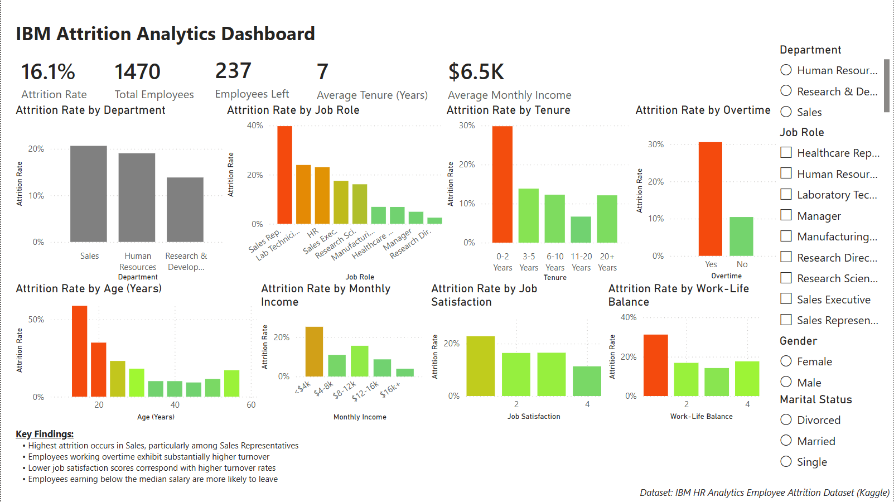

# IBM-Attrition-PowerBI-Dashboard
Interactive Power BI dashboard analyzing employee attrition using the IBM HR Analytics dataset.

IBM Employee Attrition Dashboard
Built using Power BI and the IBM HR Analytics Attrition Dataset.

Overview:
This project explores employee attrition patterns using IBM's HR Analytics Employee Attrition dataset. The dashboard was created in Microsoft Power BI to identify factors associated with turnover and demonstrate data visualization, DAX, and dashboard design skills.

Dashboard Preview:

Key Metrics:
• Attrition Rate
 • Employee Count
 • Average Tenure
 • Average Income

Dashboard Features:
Attrition by Department
Attrition by Job Role
Attrition by Tenure
Attrition by Overtime
Attrition by Monthly Income
Attrition by Age
Attrition by Job Satisfaction
Attrition by Work-Life Balance

Interactive slicers allow filtering by:
Department
Job Role
Gender
Marital Status
 
Insights:
• Sales Representatives exhibit the highest attrition.
 • Overtime is strongly associated with turnover.
 • Employees with lower job satisfaction are more likely to leave.
 • Attrition is highest during the first two years of employment.
 
Tools Used:
• Power BI
 • Power Query
 • DAX
 • Data Modeling
 • Conditional Formatting

Dataset:
IBM HR Analytics Employee Attrition Dataset (Kaggle)

Author:
Jackson Paus

